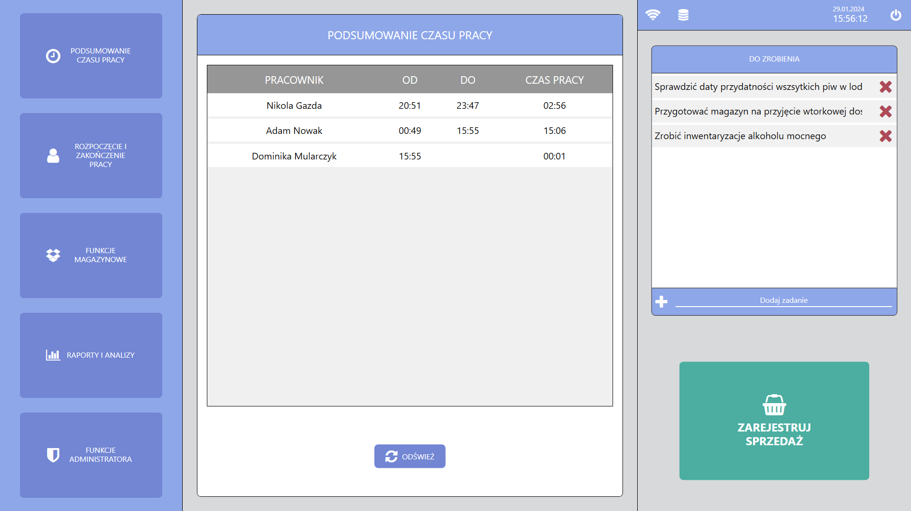
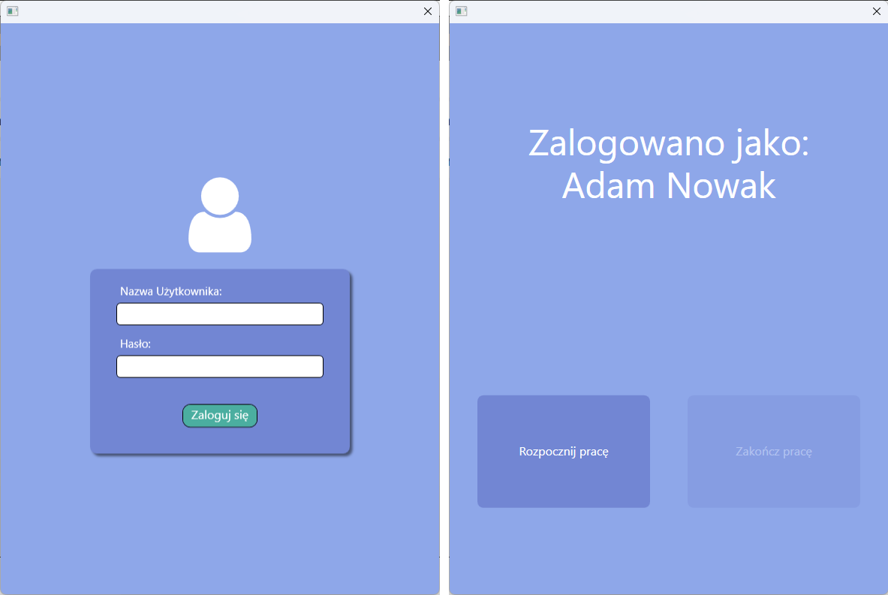
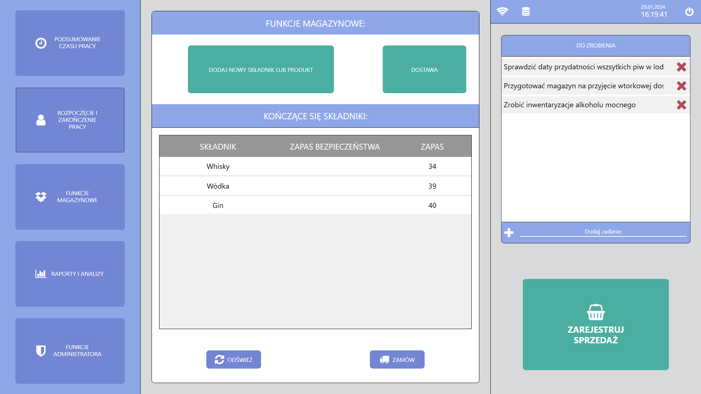
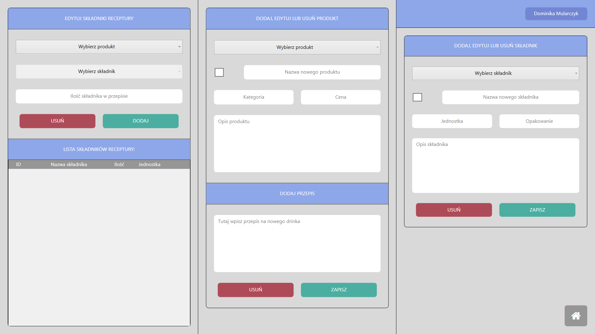
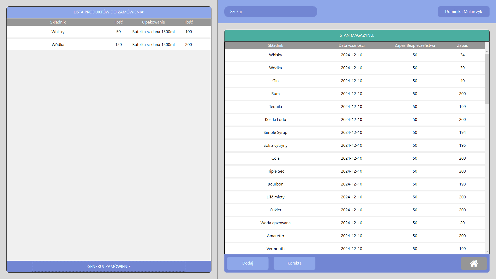
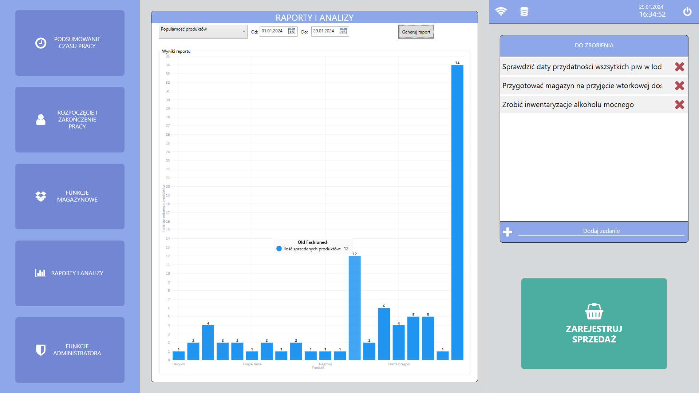
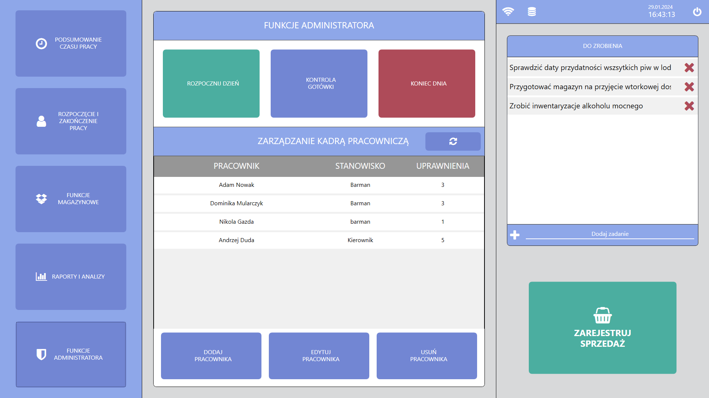
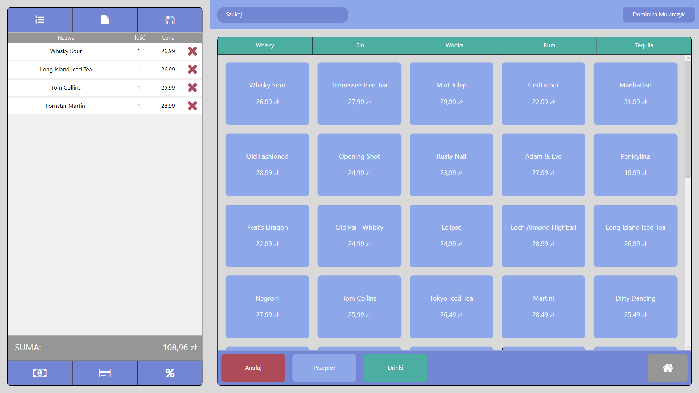
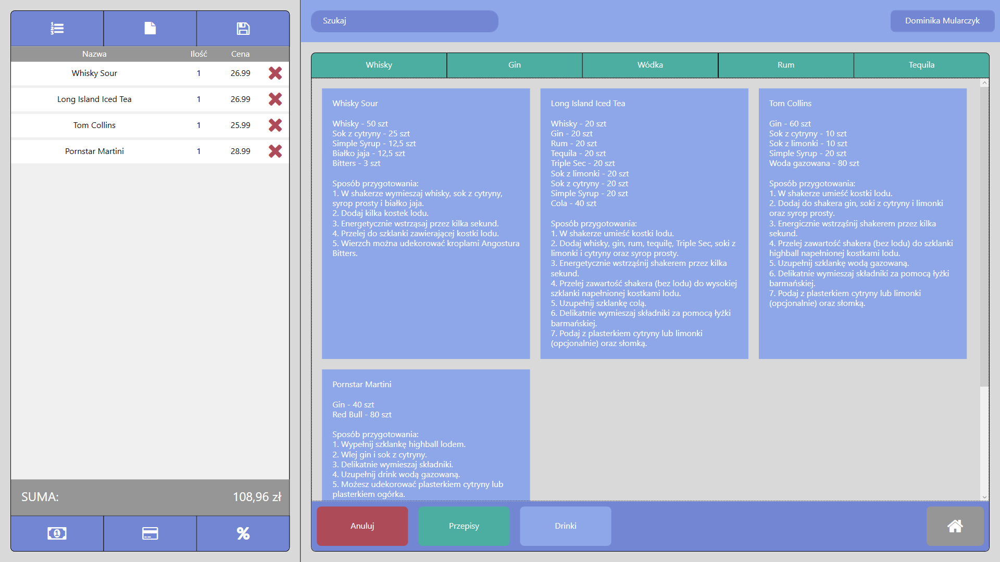
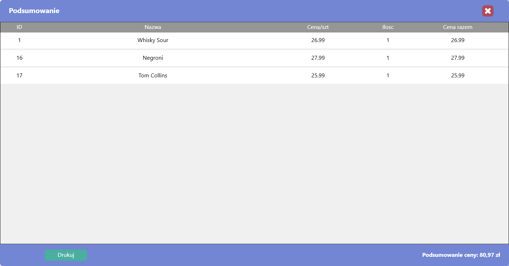

(Polska wersja znajduje się w /docs/README/README_PL.md)

```
To facilitate application testing, the following credentials are required::
Username: 00
Password: 00
```

# Point of Sale (POS) Application for Bar / Pub

## Introduction

The "POS" application is a comprehensive product designed to streamline operations and resource management in establishments such as bars or pubs. It facilitates the entire order processing workflow, including ordering, payments, and resource management, encompassing employees and inventory. Additionally, the application allows for the generation of diverse reports based on statistics. Equipped with a user-friendly and intuitive graphical interface, the application aims to provide users with a straightforward entry point for understanding its functionality, ensuring ease and efficiency of use.

## User Manual

Upon launching the application, the user is directed to the main menu, providing access to comprehensive navigation and the initial set of functionalities. Quick identification is required for most tasks, either through logging in for authorization purposes or for tracking statistics.



#### 1. "Work Time Summary" Button - Displays a summary of currently logged-in users, their start and end times, and the total hours worked.

#



#### 2. "Start and End Work" Button – Initiates the login process, followed by a window allowing a logged-in employee to either start or end their work. Upon work commencement, a timer begins in the "Work Time Summary" section, with details available by clicking Button #1.

#



#### 3. "Inventory Functions" Button – Reveals a section with buttons related to inventory tasks:

- "Add New Ingredient or Product" opens a window for managing the database of ingredients, products, and recipes.
- "Delivery" opens a window for creating supply requisitions.

Below is a table displaying depleting ingredients (those falling below the safety stock level). Two additional buttons:

- "Refresh" updates the above table, useful after receiving a delivery.
- "Order" opens a window for creating a supply requisition.

#



The window for managing the ingredient, product, and recipe database is divided into three parts:

In the first part (on the right), users can select an ingredient from the list and modify its details such as Unit, Packaging, or Description. By checking the box next to "New Ingredient Name," users can create a new ingredient by entering its name and filling in the fields below. The two buttons in this section serve to:

- "Delete" removes the selected ingredient; the button is inactive when creating a new ingredient.
- "Save" saves user-entered changes to the ingredient or creates a new one, depending on the operation.

The middle section functions similarly to the right section, but it pertains to products (drinks). Users can select a product to edit its details such as Category, Price, Description, or Recipe. Checking the box creates a new product, and the "Delete" and "Save" buttons perform the same functions as in the right section.

The third part consists of two sections: in the first, users choose a product or ingredient to add or remove from the recipe and enter the quantity. The second displays the current ingredients in the recipe for the selected product.

- "Add" adds the entered quantity of the selected ingredient to the recipe.
- "Remove" deletes the selected ingredient from the recipe.
  At the bottom right of this section is a button to return to the main window.

#



The window for creating supply requisitions is divided into two parts:
The left part displays the list of ingredients added to the requisition (delivery). The bottom part includes a button to save the list as a PDF file.

The second part displays the current inventory levels of ingredients. A search field at the top facilitates finding a specific ingredient. Below the list are three buttons:

- "Add" adds the selected ingredient to the requisition, prompting a dialogue for entering the quantity to order.
- "Adjust" allows changing the quantity of an ingredient currently in the system, useful for reconciling discrepancies.
- The home icon in all application windows returns to the main window.
  At the bottom right of this section is a button to return to the main window.

#



#### 4. "Reports and Analyses" Button – Displays a section for generating charts and tables based on user-entered data.

Starting from the top left of the section, options include:

- Selecting the type of report to generate.
- Choosing a time frame for report generation.
- The "Generate Report" button initiates the report generation.
- Charts are interactive; hovering over a column reveals details relevant to it.

#



#### 5. "Administrator Functions" Button – Displays a section with administrator functions.

After logging in as an administrator, the following buttons are accessible, starting from the top left:

- "Start Day" allows initiating a new working day, enabling report generation based on a time frame.
- "Cash Control" monitors the expected amount of cash in the fiscal register, facilitating the review of the fiscal cash register's status.
- "End Day" allows ending the working day, enabling report generation based on a time frame.
- "Add Employee" opens a window for adding a new employee, with input fields described next to each data entry field.
- "Edit Employee" – After selecting an employee, displays a window for editing the selected employee's data.
- "Remove Employee" – Deletes the selected employee.
  Within the "Administrator Functions" section is a subsection called "Employee Management," featuring a table listing all employees, their job positions, and permission levels. To update the table by adding, editing, or removing an employee, pressing the "Refresh" button next to the subsection name is required.

#



#### 6. "Register Sale" Button - The most frequently used button, directing users to the sales panel for processing product sales. This crucial button is accessible from most areas of the application.

In the section on the right, users can filter (search) products by category using buttons above the product selection buttons and through a search bar for specific names above the categories.

Below the section with product selection buttons are four buttons:

- "Cancel" removes the selected item from the sales list on the right.
- "Recipes" displays recipes (bartender guidelines) for items previously added to the sales list.



- "Drinks" – When in a section such as recipes, this button returns to the section with selectable items to add to the sales list.
- "Home (home icon)" – Allows returning to the main application screen.
  In the section on the left are several buttons for manipulating the order. Starting from the top left, the following buttons and their functions:
- "Order List (numbered list icon)" – Displays a window with a list of all completed orders.
- "Invoice (paper with folded corner icon)" – Displays a window for adding data to the invoice.
- "Save Order (floppy disk icon)" – Allows saving the list with the open order and returning to it at any time. Multiple orders can be saved, and a new order can be started by pressing the "New Order" button.


- "Discount (percentage icon)" – Opens a window with the option to apply a discount to the currently open order.
- "Credit Card Payment (credit card icon)" and "Cash Payment (banknote icon)" –
  Function similarly; clicking either displays a window with a summary of the order, including a "Print" button for printing a receipt. The window can also be closed without printing, although this does not cancel the transaction.



#

The application also includes a "To-Do List." Its primary functions are adding tasks and deleting them. Although seemingly trivial, this list will prove highly useful in daily operations. The list view is repeatedly seen in screenshots from the main window.

To exit the application, click the button in the top right corner of the main window.
