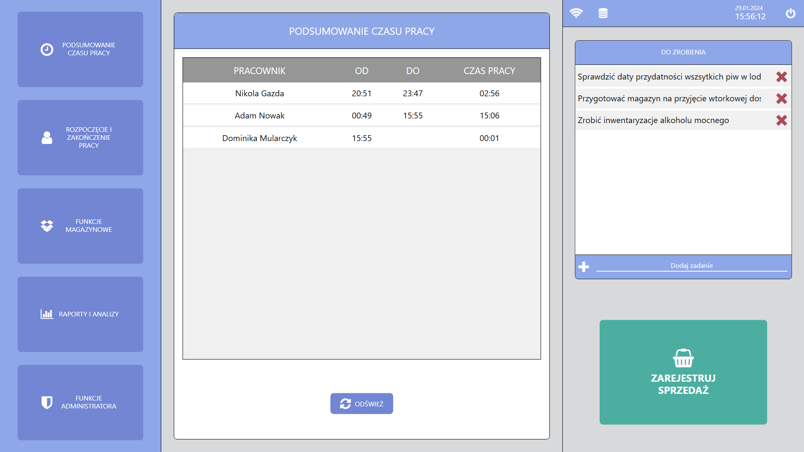
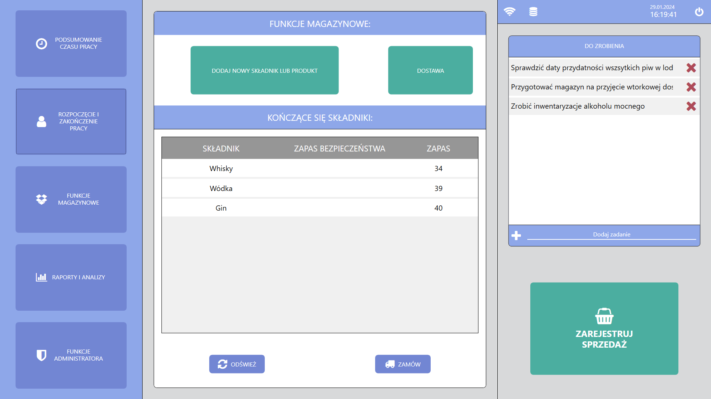
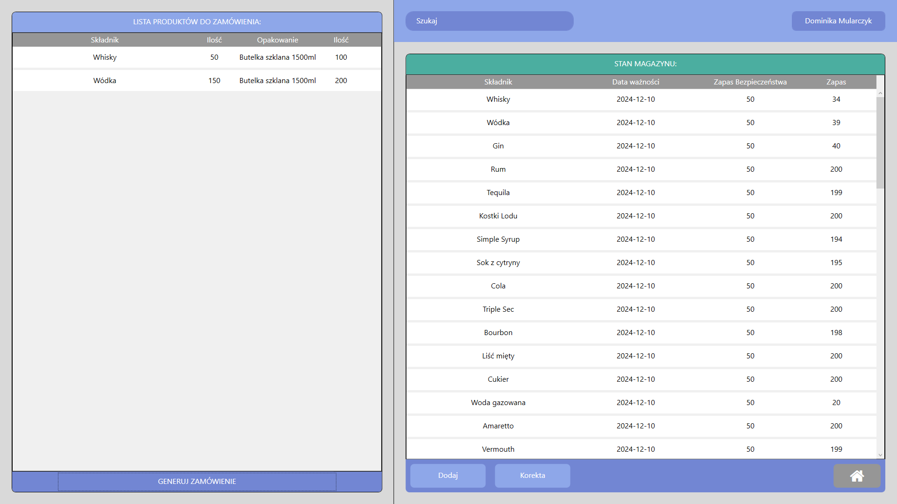
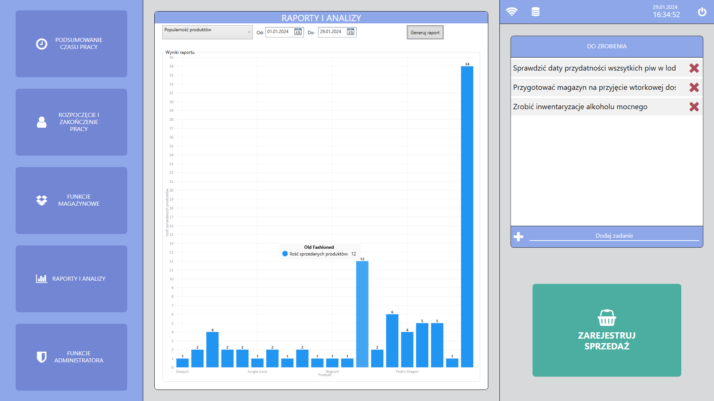
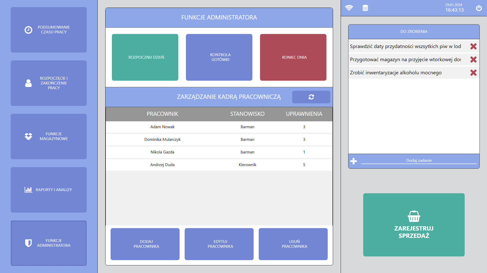
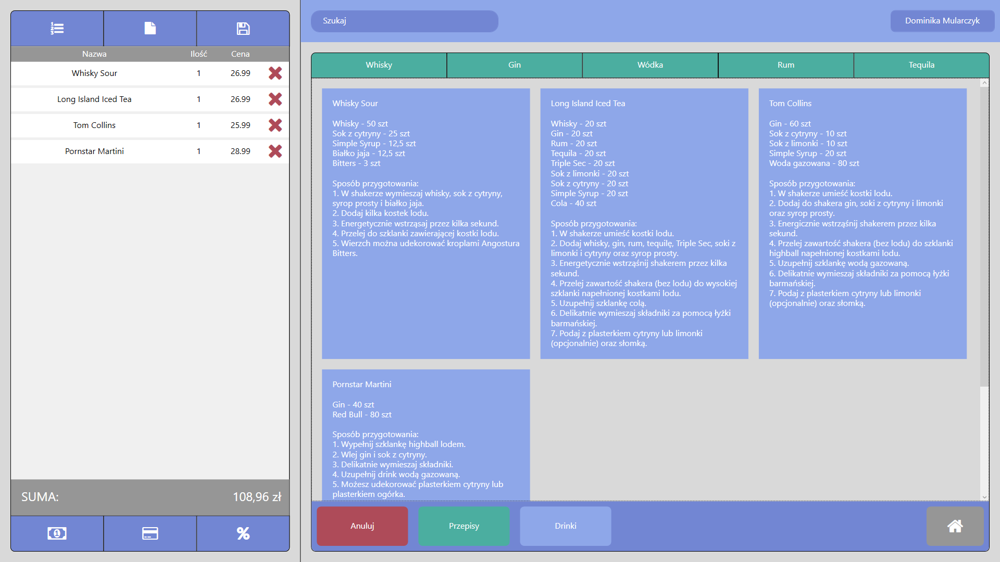

```
Aby móc testować aplikację, potrzebne będzie:
Login: 00
Hasło: 00
```

# Aplikacja "Punkt sprzedaży" dla baru / pubu

### Wstęp

Aplikacja "POS" to kompletny produkt zaprojektowany z myślą o usprawnieniu operacyjności oraz zarządzaniu zasobami w przedsiębiorstwach takich jak bary czy puby. Umożliwia ona przeprowadzenie wszystkich etapów obsługi zamówień, włączając w to proces zamawiania, płatności oraz zarządzania zasobami w firmie, w tym pracownikami i stanami magazynowymi. Ponadto aplikacja pozwala generować różnorodne raporty oparte na statystykach. Aplikacja została wyposażona w przyjazny i intuicyjny interfejs graficzny, którego celem jest zapewnienie użytkownikom maksymalnej prostoty w zrozumieniu działania programu. Dzięki temu progu wejścia, korzystanie z aplikacji staje się łatwe i efektywne.

## Instrukcja użytkowania

Użytkownik po uruchomieniu aplikacji zostaje przeniesiony do głównego menu, skąd ma dostęp do
pełnej nawigacji poruszania się po aplikacji, oraz posiada dostęp do pierwszych jej funkcjonalności. W przypadku większości czynności wymagane jest szybka identyfikacja osoby wykonującą daną czynność, w postaci logowania chociażby z powodu uprawnień lub prowadzenia statystyk.



#### 1. Przycisk „Podsumowanie czasu pracy” - Na ekranie głównym wyświetla nam zestawienie aktualnie zalogowanych osób w systemie oraz czas rozpoczęcia i zakończenia pracy, a także suma przepracowanych godzin.

#


#### 2. Przycisk „Rozpoczęcie i zakończenie pracy” – Wyświetla nam w pierwszej kolejności okienko do zalogowania się, następnie wyświetlane jest okienko w którym wcześniej zalogowany pracownik może albo rozpocząć swoją pracę, albo ją zakończyć. Po rozpoczęciu pracy w sekcji „Podsumowanie czasu pracy”, wystartuje zegar, którego podsumowanie można zobaczyć po kliknięciu w przycisk nr 1.

#



#### 3. Przycisk „Funkcje magazynowe” – Na ekranie głównym wyświetla nam sekcję w której znajdują się przyciski otwierające poszczególne okna związane zadaniami magazynowymi:

- Przycisk „Dodaj nowy składnik lub produkt” otwiera okno programu w którym zarządzamy bazą składników, produktów i przepisów.
- Przycisk „Dostawa” - otwiera okno w którym tworzymy zgłoszenie zapotrzebowania – dostawę

Poniżej znajduje tabela wyświetlające kończące się składniki (składniki których ilość jest poniżej zapasu bezpieczeństwa). Oraz dwa kolejne przyciski:

- Przycisk „odśwież” aktualizuje powyższą tabelę – może być to przydatne po przyjęciu dostawy.
- Przycisk „Zamów” otwiera okno w którym tworzymy zgłoszenie zapotrzebowania – dostawę.

#


Okno do zarządzania bazą składników, produktów i przepisów jest podzielone na 3 części:

W pierwszej części (od prawej) użytkownik może wybrać składnik z listy a następnie zmienić jego
dane takie jak Jednostka, opakowanie czy opis składnika. Zaznaczając kwadracik obok pola „nazwa
nowego składnika” użytkownik może stworzyć nowy składnik podając jego nazwę oraz uzupełniając
poniższe pola. Dwa przyciski znajdujące się w tej sekcji służą do:

- Przycisk „Usuń” do usunięcia wybranego składnika, przycisk nie działa gdy chcemy utworzyć nowy składnik.

- Przycisk „Zapisz” zapisuje wprowadzone przez użytkownika zmiany w składniku lub tworzy nowy
  składnik (w zależności od wykonywanej operacji).

Środkowa sekcja funkcjonuje analogicznie do sekcji pierwszej (z prawej), z tą różnicą że dotyczy
produktów (drinków). Zatem możemy wybrać produkt do edycji jego danych takich jak: kategoria,
cena, opis, przepis. Zaznaczając kwadracik tworzymy nowy produkt, a przyciski „usuń” i „zapisz”
robią dokładnie to samo co w sekcji z prawej.

Trzecia część okna składa się z dwóch sekcji, w pierwszej wybieramy produkt, składnik który chcemy
dodać do przepisu lub usunąć oraz podajemy ilość dodawanego składnika. W drugiej wyświetla się
lista aktualnych składników w przepisie wybranego produktu.

- Przycisk „Dodaj” dodaje wpisaną ilość wybranego składnika do przepisu (listy składników) na
  wybrany produkt.
  str. 9
- Przycisk „Usuń” usuwa wybrany składnik z przepisu na wybrany produkt.

W sekcji tej na samym dole po prawej znajduje się przycisk powrotu do głównego okna.

#



Okno do tworzenia zgłoszeń zapotrzebowania podzielone jest na dwie części:
W pierwszej części (po lewej) wyświetlana jest lista składników dodanych do zgłoszenia (dostawy).
W dolnej części znajduje się przycisk pozwalający na zapisanie listy w formie pliku pdf.

Druga cześć okna wyświetla aktualne zapasy składników w magazynie. Na górze znajduje się pole do
wyszukiwania, które ułatwia znalezienie konkretnego składnika. Poniżej listy, znajdują się 3
przyciski:

- Przycisk „dodaj” dodaje zaznaczony składnik do zgłoszenia (dostawy), po jego kliknięciu
  wyskakuje okienko dialogowe w którym użytkownik wprowadza ilość produktu którą chce
  zamówić.
  str. 10
  widok okienka dialogowego
- Przycisk „korekta” pozwala zmienić ilość składnika jaka według systemu jest aktualnie na
  magazynie, jest to przydatne gdy występują rozbieżności między stanem w systemie a
  rzeczywistą ilością przechowywanych składników.
- Przycisk z ikoną domku służy we wszystkich okienkach programu do powrotu do głównego okna.

W sekcji tej na samym dole po prawej znajduje się przycisk powrotu do głównego okna.

#



#### 4. Przycisk „Raporty i analizy” – Na ekranie głównym wyświetla nam sekcję w której znajduję się generowane wykresy i tabelę na podstawie wprowadzonych danych użytkownika

Patrząc od lewego górnego rogu sekcji, widzimy opcję:

- rodzaj raportu jaki chcemy wygenerować
- przedział czasowy na podstawie którego raport będzie generowany
- przycisk "Generuj raport" służący generowaniu raportu

Wykresy są interaktywne, możemy najechać na poszczególną kolumnę, aby wyświetlić szczegóły, czego ona dotyczy.

#



#### 5. Przycisk „Funkcje administratora” – Na ekranie głównym wyświetla nam sekcję gdzie znajdują się funkcję administratora

Po zalogowaniu się na konto administratora mamy dostęp do następujących przycisków patrząc od lewego górnego rogu:

- Przycisk „Rozpocznij dzień” – pozwala nam na rozpoczęcie nowego dnia pracy, daje nam to
  możliwość generowania raportów na podstawie przedziału czasowego
- Przycisk „Kontrola gotówki” – system rejestruje ile gotówki powinno znajdować się w kasie
  fiskalnej, dzięki czemu możemy skontrolować stan naszej kasy fiskalnej (ile powinno się w
  kasie fiskalnej znajdować pieniędzy)
- Przycisk „Koniec dnia” – pozwala nam na zakończenie dnia pracy, daje nam to możliwość
  generowania raportów na podstawie przedziału czasowego
- Przycisk „Dodaj pracownika” – wyświetla okienko umożliwiające dodanie nowego
  pracownika. Poszczególne okienka z możliwością wprowadzenia danych są opisane obok
  pola do wprowadzenia danych
- Przycisk „Edytuj pracownika” – po wcześniejszym zaznaczeniu pracownika wyświetla się nam okienko z możliwością edycji danych zaznaczonego pracownika
- Przycisk „Usuń pracownika” – Usuwa wcześniej zaznaczonego pracownika

W sekcji „Funkcje administratora” znajduje się podsekcja „Zarządzanie kadrą pracowniczą” w której
widzimy tabelę ze wszystkimi pracownikami ich stanowiskiem pracy i poziomem uprawnień. W celu
optymalizacji aktualizacja tabeli poprzez dodanie, edycję lub usunięcie pracownika nie zachodzi
automatycznie, wymagane jest naciśnięcie przycisku „Odśwież” znajdującego się obok napisu nazwy
podsekcji.

#


#### 6. Przycisk „Zarejestruj sprzedaż” - Będzie to najczęściej wykorzystywany przycisk, którego użycie przenosi nas do panelu sprzedaży, czyli do miejsca w którym wykonuje się proces sprzedaży produktu. Przycisk jest tak istotny, że dostęp do niego mamy z większości miejsc w aplikacji.

W sekcji po prawej stronie mamy możliwość filtrowania (wyszukiwania) produktów poprzez dzielenie ich na kategorię poprzez przyciski znajdujące się powyżej przyciskami z wyborem produktów, oraz poprzez wyszukiwarkę konkretnej nazwy znajdującą się nad kategoriami.

Poniżej sekcji z wyborem produktów dodawanych do listy zamówienia mamy 4 przyciski

- Przycisk „Anuluj” – usuwa zaznaczoną pozycje z listy zamówienia znajdującej się po prawej
  stronie
- Przycisk „Przepisy” – Wyświetla nam przepisy (wskazówki dla barmana) w jaki sposób wykonać poszczególne pozycje dodane wcześniej do listy zamówień



- Przycisk „Drinki” – w momencie kiedy jesteśmy chociażby w sekcji z przepisami, przycisk ten zapewnia nam powrót do sekcji z wyborem pozycji, które możemy dodać do listy zamówień
- Przycisk „Home (ikona domu)” – Z pomocą tego przycisku możemy powrócić do ekranu
  głównego aplikacji

W sekcji po lewej stronie mamy kilka przycisków umożliwiających manipulację zamówieniem.
Zaczynając od lewego górnego rogu mamy następujące przyciski i ich funkcje:

- Przycisk „Lista zamówień (ikona ponumerowanej listy)” – wyświetla nam okienko z listą wszystkich zrealizowanych zamówień
- Przycisk „Faktura (ikona kartki papieru z zagiętym rogiem)” – wyświetla nam okienko z możliwością dodania danych do faktury
- Przycisk „Zapisz zamówienie (ikona dyskietki)” – Przycisk pozwalający nam na zapisanie listy z otwartym zamówieniem i powrót do niej w dowolnym możliwym momencie, zamówień możemy zapisać wiele, jednocześnie pojawia nam się możliwość rozpoczęcia nowego zamówienia poprzez naciśnięcie przycisku „Nowe zamówienie”


- Przycisk „Rabat (ikona procentu)” – otwiera nam okienko z możliwością zastosowania rabatu na aktualnie otwarte zamówienie
- Przyciski „Płatność kartą (ikona karty płatniczej) i „Płatność gotówką (ikona banknotu)” –
  działający w podobny sposób, naciśniecie na któreś z nich wyświetla nam okienko z
  podsumowaniem zamówienia w którym znajduje się przycisk „drukuj” służący do
  wydrukowania paragonu, okienko można także zamknąć bez drukowania, jednakże nie jest to jednoznaczne z anulowaniem.


#

Aplikacja posiada także listę rzeczy „Do zrobienia” - Jej podstawowymi a zarazem jedynymi funkcjami są możliwość dodania zadania i jego usunięcie, mimo iż brzmi to trywialnie, lista ta będzie na pewno bardzo przydatna w codziennej pracy. Widok listy wielokrotnie powtarzał się w zrzutach ekranu z głównego okna.

Aby wyłączyć aplikację naciskamy na przycisk znajdujący się w prawym górnym rogu głównego okna.
